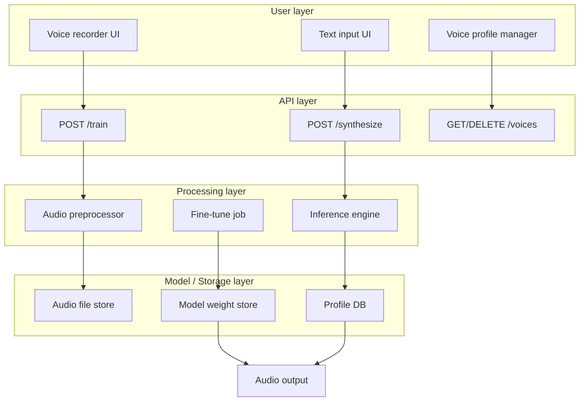
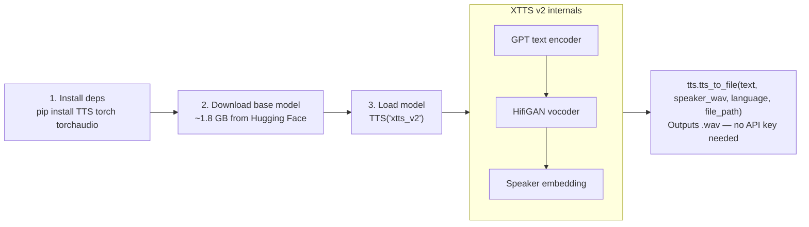
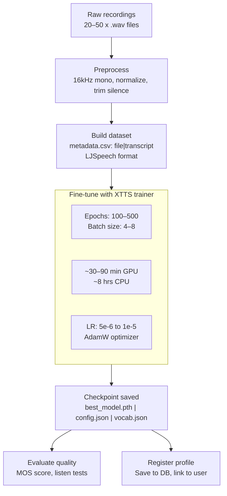
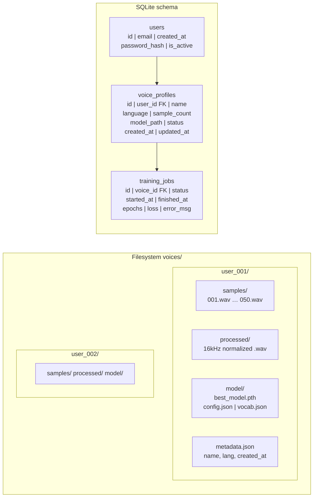
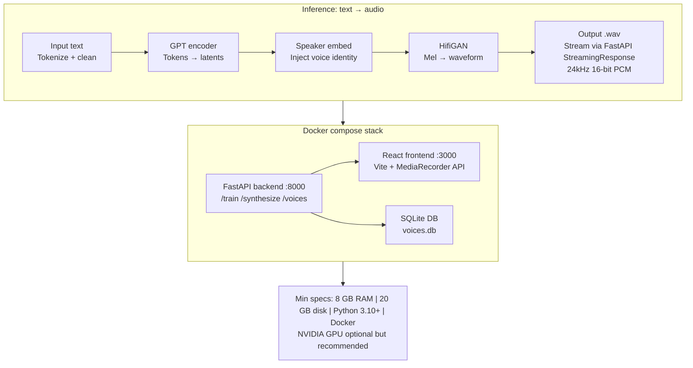

**1 — Full system architecture**

```mermaid
flowchart TD
  subgraph USER["User layer"]
    U1[Voice recorder UI]
    U2[Text input UI]
    U3[Voice profile manager]
  end
  subgraph API["API layer"]
    A1["POST /train"]
    A2["POST /synthesize"]
    A3["GET/DELETE /voices"]
  end
  subgraph PROC["Processing layer"]
    P1[Audio preprocessor]
    P2[Fine-tune job]
    P3[Inference engine]
  end
  subgraph STORE["Model / Storage layer"]
    S1[Audio file store]
    S2[Model weight store]
    S3[Profile DB]
  end
  OUT[Audio output]

  U1 --> A1
  U2 --> A2
  U3 --> A3
  A1 --> P1
  A2 --> P3
  P1 --> S1
  P2 --> S2
  P3 --> S3
  S2 --> OUT
  S3 --> OUT
```

**2 — XTTS v2 engine setup**

```mermaid
flowchart LR
  I1["1. Install deps\npip install TTS torch torchaudio"]
  I2["2. Download base model\n~1.8 GB from Hugging Face"]
  I3["3. Load model\nTTS('xtts_v2')"]
  subgraph INTERNALS["XTTS v2 internals"]
    E1[GPT text encoder] --> E2[HifiGAN vocoder] --> E3[Speaker embedding]
  end
  OUT2["tts.tts_to_file(text, speaker_wav, language, file_path)\nOutputs .wav — no API key needed"]

  I1 --> I2 --> I3 --> INTERNALS --> OUT2
```

**3 — Voice training pipeline**

```mermaid
flowchart TD
  R[Raw recordings\n20–50 x .wav files]
  P["Preprocess\n16kHz mono, normalize, trim silence"]
  D["Build dataset\nmetadata.csv: file|transcript\nLJSpeech format"]
  subgraph FT["Fine-tune with XTTS trainer"]
    F1["Epochs: 100–500\nBatch size: 4–8"]
    F2["~30–90 min GPU\n~8 hrs CPU"]
    F3["LR: 5e-6 to 1e-5\nAdamW optimizer"]
  end
  C["Checkpoint saved\nbest_model.pth | config.json | vocab.json"]
  EV[Evaluate quality\nMOS score, listen tests]
  REG[Register profile\nSave to DB, link to user]

  R --> P --> D --> FT --> C --> EV
  C --> REG
```

**4 — Voice profile & model weight storage**

```mermaid
flowchart LR
  subgraph FS["Filesystem  voices/"]
    subgraph U001["user_001/"]
      SA[samples/\n001.wav … 050.wav]
      PR[processed/\n16kHz normalized .wav]
      MO["model/\nbest_model.pth\nconfig.json | vocab.json"]
      ME[metadata.json\nname, lang, created_at]
    end
    subgraph U002["user_002/"]
      U2F[samples/ processed/ model/]
    end
  end
  subgraph DB["SQLite schema"]
    T1["users\nid | email | created_at\npassword_hash | is_active"]
    T2["voice_profiles\nid | user_id FK | name\nlanguage | sample_count\nmodel_path | status\ncreated_at | updated_at"]
    T3["training_jobs\nid | voice_id FK | status\nstarted_at | finished_at\nepochs | loss | error_msg"]
    T1 --> T2 --> T3
  end
```

**5 — Inference pipeline & local setup**

```mermaid
flowchart TD
  subgraph INF["Inference: text → audio"]
    N1[Input text\nTokenize + clean]
    N2[GPT encoder\nTokens → latents]
    N3[Speaker embed\nInject voice identity]
    N4[HifiGAN\nMel → waveform]
    N5[Output .wav\nStream via FastAPI StreamingResponse\n24kHz 16-bit PCM]
    N1 --> N2 --> N3 --> N4 --> N5
  end
  subgraph DC["Docker compose stack"]
    D1["FastAPI backend :8000\n/train  /synthesize  /voices"]
    D2["React frontend :3000\nVite + MediaRecorder API"]
    D3["SQLite DB\nvoices.db"]
    D1 --> D2
    D1 --> D3
  end
  SPEC["Min specs: 8 GB RAM | 20 GB disk | Python 3.10+ | Docker\nNVIDIA GPU optional but recommended"]
  INF --> DC --> SPEC
```
